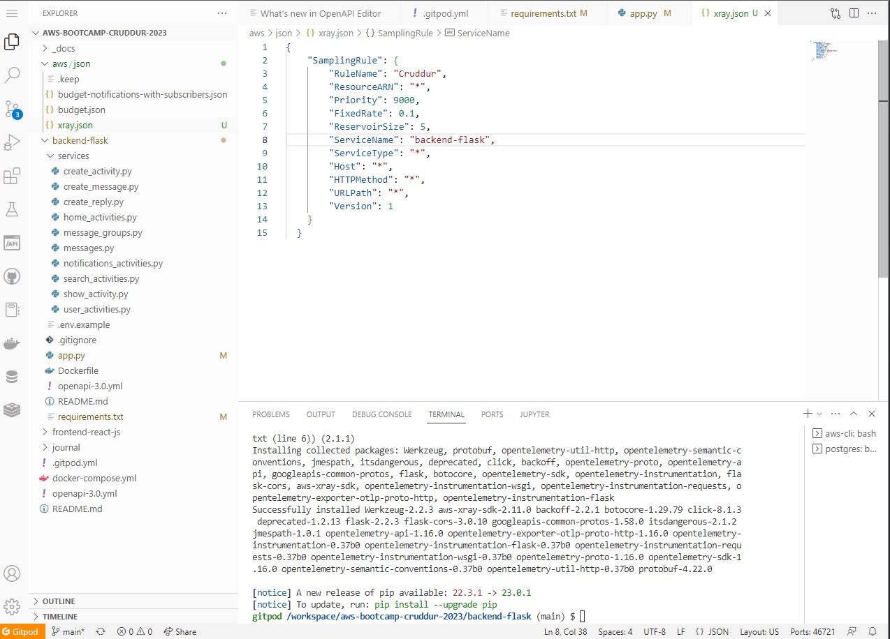

# Week 2 — Distributed Tracing
## Watched week 2  live stream 
- honey comb data

- data span

- span heat map

- span query

- xray 

- instrument xray

- Cruddur log group cration

- x ray successfully sent segments

- xray traces

- cloudwatch logs

